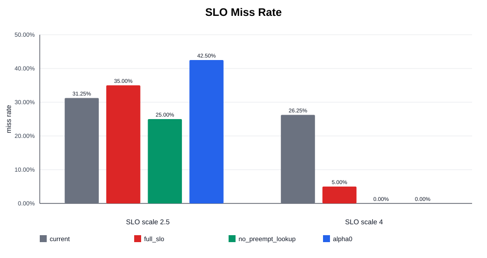
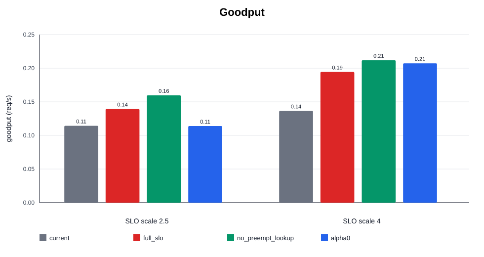
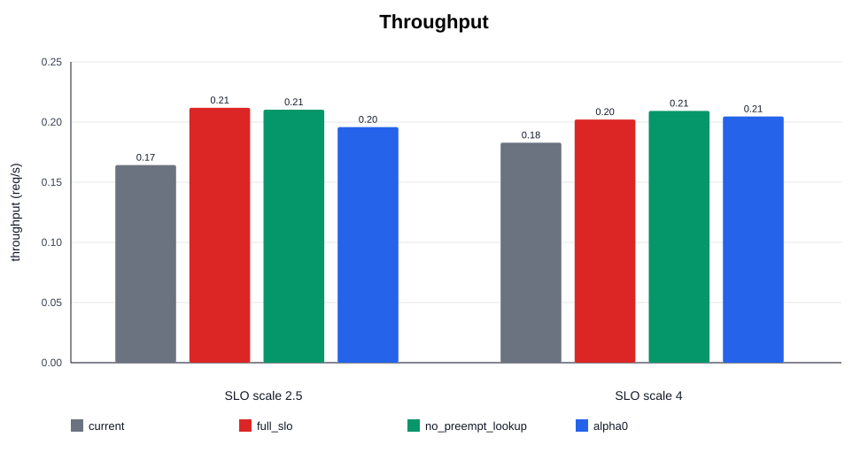
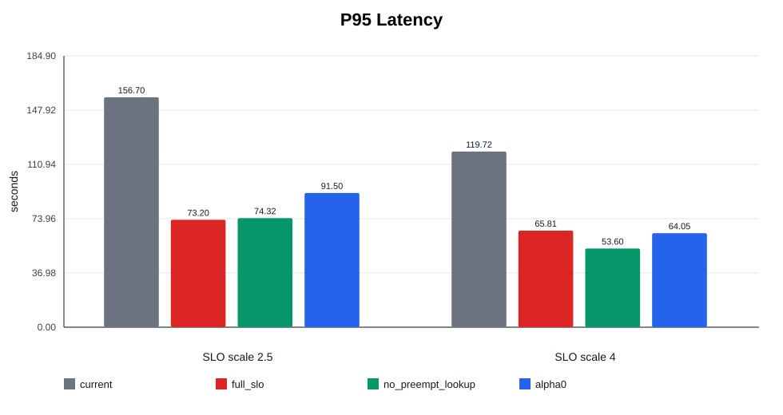
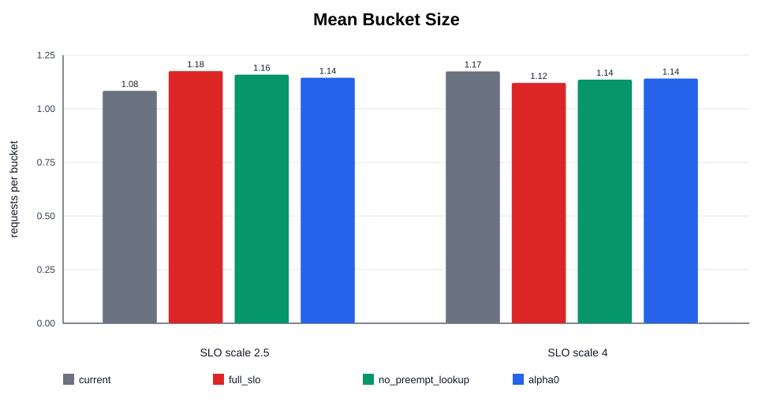
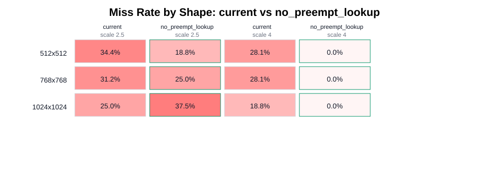

# E2E SLO 调度单次实验结果

本目录保存 910B 上一次清理后的 E2E SLO 调度实验结果。原始运行目录是：

```text
benchmark_outputs/e2e_slo_no_preemption_repeats
```

为了便于推送到 GitHub，本目录只保留结构化小文件、图表和复现实验所需的关键配置；`step_cost_raw*.jsonl`、`stagepool_profile.jsonl`、`server.log`、`client.log`、`trace.txt` 等运行期大文件或临时文件不纳入版本库。它们的大小和行数记录在 `omitted_artifacts_manifest.csv` 中。

## 实验设置

- 模型：`Qwen/Qwen-Image`
- 硬件：910B，8 张 NPU
- 部署：4 个 diffusion replica，每个 replica 使用 `TP=2`，`max_num_seqs=4`
- 请求数：80
- 到达过程：固定 interarrival `4.25s`
- denoise steps：50
- workload：合成 trace，prompt 来自 ImageNet label，shape 按 `512x512, 768x768, 512x512, 768x768, 1024x1024` 循环
- shape 分布：`512x512` 32 个，`768x768` 32 个，`1024x1024` 16 个
- SLO：`SLO = reference_cost * slo_scale`，reference cost 来自 offline lookup step cost table

## 对比策略

- `current`：当前 vLLM-Omni 调度逻辑，作为 baseline。
- `full_slo`：StagePool + instance 都启用 SLO-aware，并使用 lookup cost；包含当前版本的 step-level preemption。
- `slo_no_preemption_lookup`：StagePool + instance 都启用 SLO-aware，使用 lookup cost，但关闭 step-level preemption。
- `alpha0`：SLO-aware 变体，`batch_growth_alpha=0`，用于观察 batch cost 增长项对结果的影响。

## 关键结论

本轮最稳的候选是 `slo_no_preemption_lookup`。

- 在 `slo_scale=2.5` 下，miss rate 从 `current` 的 31.25% 降到 25.00%，goodput 从 0.1137 提升到 0.1588。
- 在 `slo_scale=4.0` 下，miss rate 从 `current` 的 26.25% 降到 0.00%，goodput 从 0.1358 提升到 0.2107。
- `full_slo` 在宽松 SLO 下有效，但在 `slo_scale=2.5` 下比 baseline 更差，说明第一版 step-level preemption 不应默认打开。
- `alpha0` 在紧 SLO 下最差，说明 cost model 里保留 batch growth / lookup 信息是必要的。

## 指标表

| Policy | SLO scale | Miss rate | Goodput | Throughput | P95 latency | Mean bucket |
|---|---:|---:|---:|---:|---:|---:|
| `alpha0` | 2.5 | 42.50% | 0.1134 | 0.1972 | 91.50s | 1.145 |
| `current` | 2.5 | 31.25% | 0.1137 | 0.1654 | 156.70s | 1.084 |
| `full_slo` | 2.5 | 35.00% | 0.1387 | 0.2133 | 73.20s | 1.176 |
| `slo_no_preemption_lookup` | 2.5 | 25.00% | 0.1588 | 0.2117 | 74.32s | 1.159 |
| `alpha0` | 4 | 0.00% | 0.2061 | 0.2061 | 64.05s | 1.141 |
| `current` | 4 | 26.25% | 0.1358 | 0.1842 | 119.72s | 1.175 |
| `full_slo` | 4 | 5.00% | 0.1934 | 0.2036 | 65.81s | 1.121 |
| `slo_no_preemption_lookup` | 4 | 0.00% | 0.2107 | 0.2107 | 53.60s | 1.136 |

## 图表













## 文件说明

- `ablation_summary.json`：完整结构化汇总。
- `ablation_table.csv`：聚合指标表。
- `results_by_policy_scale.csv`：扁平化后的 policy × scale 指标。
- `miss_by_shape.csv`：按 shape 统计的 miss rate 和 latency。
- `benchmark_results/*/scale_*/benchmark_result.json`：每组 benchmark 的原始结构化结果。
- `trace_manifests/*/scale_*/trace.txt.manifest.json`：请求 trace 的 manifest。
- `configs/qwen_image_4replicas_tp2.yaml`：本次服务部署配置。
- `figures/*.svg`：可视化图表。
- `review_notes.md`：独立 subagent 对结果真实性的 review 摘要。
- `omitted_artifacts_manifest.csv`：未提交的大文件/运行期文件清单。

## Caveat

这是单次 `repeat_0` 结果，只适合作为当前方向的有效观测，不应直接当作有统计置信度的最终结论。下一步需要对关键组合补 repeat，并扩展 workload 的 shape mix、arrival pattern 和 SLO scale。
