# Qwen-Image Stage Pipeline

This document summarizes the implemented Qwen-Image text-to-image pipeline split
on top of PR4024 dynamic step batching. The split keeps PR4024's heterogeneous
DiT token batching in the DiT stage, while moving text encoding and VAE decoding
into independent diffusion stages so adjacent requests can overlap.

Out of scope for these stages: full DAG runtime, PARD, global SLO scheduling,
step-level preemption, and transport optimization.

## Current Monolithic Path

```mermaid
flowchart LR
  A["OpenAI image request"] --> B["QwenImagePipeline.prepare_encode"]
  B --> C["text encoder + latent/timestep preparation"]
  C --> D["DiffusionModelRunner.execute_stepwise"]
  D --> E["QwenImagePipeline.denoise_step"]
  E --> F["PR4024 token dynamic DiT batch"]
  F --> G["QwenImagePipeline.step_scheduler"]
  G --> H["QwenImagePipeline.post_decode"]
  H --> I["VAE decode + final image"]
```

The original text-to-image path is one diffusion stage. PR4024 changes how DiT
denoise steps batch heterogeneous requests, but it does not split Qwen-Image text
encoding or VAE decoding into separate stages.

## Module Map

| Module | Current code path | T2I critical path | Split-stage feasibility | Data passed after split |
| --- | --- | --- | --- | --- |
| text encoder | `vllm_omni/diffusion/models/qwen_image/pipeline_qwen_image.py`: `QwenImagePipeline.__init__` loads `text_encoder`; `_get_qwen_prompt_embeds()` tokenizes and runs `self.text_encoder`; `encode_prompt()` repeats/truncates embeddings; `prepare_encode()` calls `_prepare_generation_context()`. | Yes. It runs before the first DiT step for every new request. | Feasible. It can become an encoder stage because its outputs are explicit tensors and sequence metadata. | `prompt_embeds`, `prompt_embeds_mask`, `negative_prompt_embeds`, `negative_prompt_embeds_mask`, `txt_seq_lens`, `negative_txt_seq_lens`, `do_true_cfg`, CFG scale/normalize metadata. |
| ViT / image encoder | In T2I `QwenImagePipeline`, the Qwen2.5-VL vision tower is deleted during init because text-to-image does not use it. Image-aware encoding appears in `pipeline_qwen_image_edit.py` and related edit paths through `processor(..., images=...)` and `text_encoder(..., pixel_values=..., image_grid_thw=...)`. | No for Qwen-Image T2I. It is relevant to edit/layered paths. | Not part of the first T2I split. It should be recorded as a future image-input encoder stage. | For edit/layered paths: image-conditioned prompt embeddings and masks, plus image grid metadata if preserved. |
| VAE encoder | T2I `QwenImagePipeline.prepare_latents()` creates random latents and does not encode an input image. VAE image encode appears in edit/layered paths: `_encode_vae_image()` calls `self.vae.encode(image)` and normalizes image latents. | No for Qwen-Image T2I. Relevant to image edit/layered. | Not part of the first T2I split. It becomes an input-image encoder stage for edit/layered support. | `image_latents` and normalization metadata if needed. |
| DiT compute | `QwenImagePipeline.denoise_step()` builds dense or dynamic kwargs. Dynamic mode uses `_denoise_step_dynamic_batch()`, request-local latents, prompt embeddings, CFG metadata, and PR4024 varlen attention metadata prepared by `DiffusionModelRunner._prepare_attn_metadata()`. | Yes. It is the main compute path. | Keep as the DiT stage. Do not move PR4024 dynamic batching out of it. | Inputs: encoded prompt tensors, masks, latents, timesteps, `img_shapes`, guidance/CFG metadata. Outputs: updated final latents plus decode metadata after all denoise steps. |
| VAE decoder | `QwenImagePipeline.post_decode()` calls `_decode_latents()`, which unpacks final packed latents, denormalizes with VAE config mean/std, and calls `self.vae.decode(...)`. | Yes. It runs once after denoise completes and currently blocks the same worker. | First split target. It can become a decoder stage because it only needs final latents and decode metadata. | `latents`, `height`, `width`, `output_type`, `vae_scale_factor`, and VAE normalization config. |
| audio decoder | No Qwen-Image T2I audio decoder path exists in the inspected Qwen-Image files. Other diffusion models may return audio, but they are outside this T2I split. | No. | Out of scope. | None. |

## PR4024 Dynamic Batching Boundary

PR4024 keeps heterogeneous request fields out of the homogeneous sampling key.
`get_sampling_params_key()` only keeps compatibility fields such as CFG and
LoRA. The worker then builds an `InputBatch` where request-local fields such as
latent token count, text length, CFG scale, and shape metadata can differ across
requests. Dynamic DiT execution uses request-local tensors and varlen attention
metadata, then scatters one noise prediction per request back into its state.

The split pipeline must preserve this boundary: encoder and decoder stages may
move, but the DiT stage must still receive the same request-local tensors that
`InputBatch.make_batch()` expects.

## Implemented Minimal Pipeline

The implemented pipeline is a three-stage diffusion pipeline:

1. Encoder stage prepares prompt embeddings and initial denoise state.
2. DiT stage performs PR4024 dynamic step batching and updates latents.
3. Decoder stage converts final latents into images.

The goal is overlap, not a new scheduler. When the pipeline is warm, request
`i+1` can encode while request `i` denoises and request `i-1` decodes.

The committed deploy configs are:

- `vllm_omni/deploy/qwen_image_stage_pipeline.yaml`: one encode, one DiT, one
  decode stage for smoke validation.
- `vllm_omni/deploy/qwen_image_stage_pipeline_1x2x1.yaml`: one small-role card
  serving two DiT replicas for unit/smoke topology validation.
- `vllm_omni/deploy/qwen_image_stage_pipeline_1x7_shared_roles.yaml`: the
  current 8-card experiment topology. NPU0 runs encode and one decode replica;
  NPU1-7 run seven DiT replicas.

## Implementation Notes

Decoder split:

- DiT stage stops at final latents and emits decode metadata as an intermediate
  output.
- Decoder stage loads the Qwen-Image VAE and calls the same decode logic as
  `_decode_latents()`.
- The final public output remains an image response.

Encoder split:

- Encoder stage runs the same prompt validation, tokenization, text encoder,
  latent preparation, timestep preparation, and CFG metadata preparation that
  the monolithic path performed in `prepare_encode()`.
- DiT stage hydrates `DiffusionRequestState` from the encoder output instead
  of recomputing prompt embeddings inside `prepare_encode()`.
- Dynamic batching is still driven by `InputBatch.make_batch()` in the DiT
  worker.

Minimal stage data objects:

- `QwenImageEncodeOutput`: request id, encoded prompt tensors, masks, text
  lengths, latents, timesteps, image shapes, CFG/guidance metadata, sampling
  metadata needed by DiT and decode.
- `QwenImageDenoiseOutput`: request id, final latents, height, width,
  output type, and decode metadata.
- `QwenImageDecodeOutput`: request id and final `DiffusionOutput` payload.

## Validation And Results

Lightweight checks:

- Encoder output contains all fields needed to build an `InputBatch`.
- DiT state hydration from encoder output preserves the request-local tensors
  used by the monolithic `prepare_encode()` path.
- Decoder stage consumes final latents and calls the shared decode path.
- Stage configs validate one-to-many small-role and seven-DiT topologies.

Final GitHub-safe result package:

`benchmarks/diffusion/profile_results/qwen_image_1decode_4step_regression_analysis_20260605/`

Summary on 910B, 1024x1024, 42 measured requests, 7 DiT cards:

| setup | steps | throughput img/s | P95 latency s | note |
| --- | ---: | ---: | ---: | --- |
| baseline_7replica | 4 | 1.988 | 21.069 | seven full encode-DiT-decode replicas on NPU1-7 |
| pipeline_1decode | 4 | 1.762 | 23.371 | NPU0 encode+1decode, NPU1-7 DiT |
| baseline_7replica | 8 | 1.049 | 39.960 | seven full encode-DiT-decode replicas |
| pipeline_1decode | 8 | 1.138 | 36.457 | pipeline improves throughput and P95 |
| baseline_7replica | 12 | 0.713 | 58.831 | seven full encode-DiT-decode replicas |
| pipeline_1decode | 12 | 0.784 | 53.081 | pipeline improves throughput and P95 |

The 4-step case is decode-queue limited: with one decode replica, the decode
queue P95 is about 2.99s. A diagnostic run that skipped real VAE decode restored
4-step throughput above baseline, which shows the main loss is the single decode
queue tail rather than encode, DiT, or the stage framework itself.

Cleaned experiment scope:

- Random routing is not part of the Qwen-Image pipeline candidate set.
- Multi-decode sweep/count scripts, configs, and result packages were removed
  from the clean commit. The current formal topology is 1decode.
- Raw benchmark outputs, logs, JSON result files, generated images, trace files,
  and NPU sample files are intentionally omitted from GitHub.
